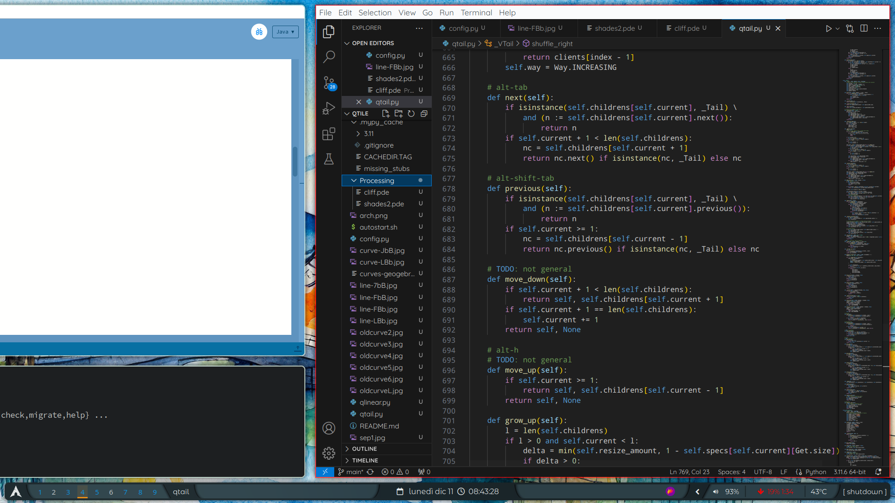

# qtile-config

My work-in-progress configuration file for Qtile includes the creation of the bottom bar and the algorithm for arranging windows on the screen, both built from scratch. Furthermore, I designed a 'shader' in Processing to render the curves with shadows, as you may see in the preview. 
